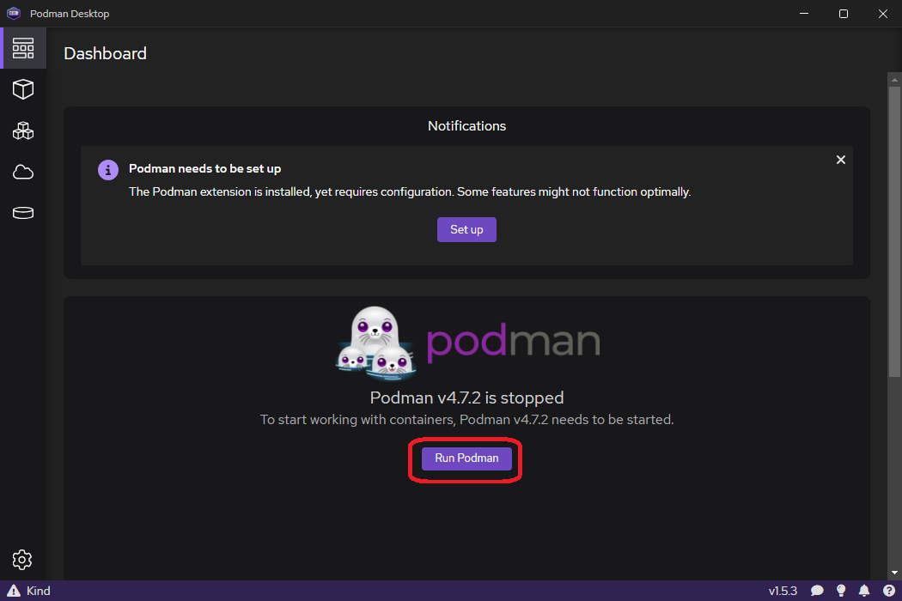

## Podman のインストール

Podman のインストール手順は以下の通り

コマンドプロンプトで以下のコマンドを実行する

```cmd
winget install -e --id RedHat.Podman
```

  
ユーザアカウント制御のダイアログが表示された場合「はい」をクリックする。

  
インストールが完了するまでしばらく待つ。

## Podman Desktop のインストール

Podman Desktop のインストール手順は以下の通り

コマンドプロンプトで以下のコマンドを実行する

```cmd
winget install -e --id RedHat.Podman-Desktop
```

## Podman Desktop の初期設定

デスクトップにショートカットができるため、ダブルクリックして起動する。


起動すると以下の画面が表示されます。  
右下の Go to Podman Desktop をクリックします。  


起動後、中央のボタン(Initialize and start)をクリックします。


Podman が初期化されるため、しばらく待ちます。  


しばらくすると、初期が処理が完了し、以下の画面が表示されます。  
中央のボタン(Run Podman)をクリックして、Podman を起動します。



起動が完了すると以下の画面が表示されます。  


次に、Podman Compose プラグインを導入します。

左下の歯車のアイコン → Resources をクリックし、Settings の Resources 画面を開きます。  
タコのアイコンの Compose の下の Setup...をクリックします。  


Compose Setup 画面が開いたら、右下の Next ボタンをクリックします。


Compose の最新版のダウンロードが開始されるため、画面が遷移するまでしばらく待ちます。


Compose Successfully Downloaded が表示されたら、右下の Next ボタンをクリックしてインストールを開始します。  
※クリック後に、ユーザアカウント制御のダイアログが表示された場合「はい」をクリックする。  


インストールが完了すると、Compose Successfully Installed が表示されます。  
終了するため右下の Next ボタンをクリックします。  


Settings 画面に戻るので、Compose の下部の Setup... ボタンが消えていることを確認します。  

